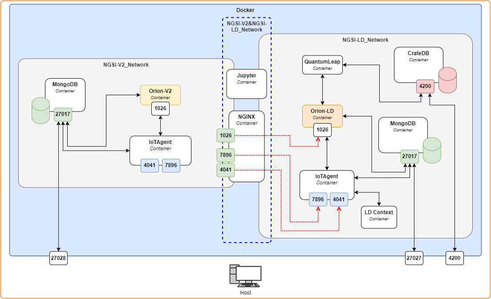

<a name="readme-top"></a>

<!-- PROJECT LOGO -->
<br />
<div align="center">
  <a href="https://github.com/CitCom-VRAIN/IoTAgent.NGSI-V2_to_NGSI-LD_Subscription">
    
  </a>

  <h3 align="center">Connecting NGSI-V2 Broker to NGSI-LD via FIWARE IoT-Agent</h3>

  <p align="center">
    Local environment for testing subscriptions between FIWARE Orion brokers NGSI-V2 to NGSI-LD via FIWARE IoT-Agent.
    <br />
    <a href="https://citcom-vrain.github.io/"><strong>Explore the docs »</strong></a>
    <br />
  </p>
</div>

<!-- TABLE OF CONTENTS -->
<details>
  <summary>Table of Contents</summary>
  <ol>
    <li>
      <a href="#about-the-project">About The Project</a>
      <ul>
        <li><a href="#built-with">Built With</a></li>
        <li><a href="#tested-on">Tested On</a></li>
      </ul>
    </li>
    <li>
      <a href="#getting-started-prerequisites">Getting Started (Prerequisites)</a>
    </li>
    <li><a href="#usage">Usage</a></li>
    <li><a href="#license">License</a></li>
    <li><a href="#references">Acknowledgments</a></li>
  </ol>
</details>

<!-- ABOUT THE PROJECT -->
## About The Project


This repo is part of the tasks of the European project [Citcom.ai](https://citcom.ai/). The main objective is to generate a test environment where to evaluate the way to communicate a NGSI-V2 broker to a NGSI-LD through the IoT-Agent (all of them [FIWARE](https://www.fiware.org/) technology).

<div align="center">
  
</div>

<p align="right">(<a href="#readme-top">back to top</a>)</p>

### Built With

<div align="center">

  | <!-- -->      |
  |:-------------:|
  | [![docker][docker]][docker-url] |
</div>

<p align="right">(<a href="#readme-top">back to top</a>)</p>

### Tested on

<div align="center">

  | <!-- -->                                 |  <!-- -->                                  
  |:----------------------------------------:|:----------------------------------------:|
  | [![ubuntu22.04.03LTS][ubuntu]][ubuntu-url]  | [![WSL2][wsl]][wsl-url]  | 
</div>

<p align="right">(<a href="#readme-top">back to top</a>)</p>

<!-- GETTING STARTED -->
## Getting Started (Prerequisites)

This project was developed on:

* Ubuntu 22.04.3 LTS
* WSL 2 (Windows Subsystem for Linux v. 2.0.14.0) - Windows 11

These are the necessary requirements to be able to execute the project:

* [Docker](https://docs.docker.com/engine/install/ubuntu/) (v. 25.0.2)
* [Docker Compose](https://docs.docker.com/compose/install/linux/#install-the-plugin-manually) (v. 1.29.2)
* GNU Make (v 4.3)
  ```bash
  sudo apt update -y
  sudo apt install make
  ```

<p align="right">(<a href="#readme-top">back to top</a>)</p>


<!-- USAGE EXAMPLES -->
## Usage

1. Clone the repository.

2. Deploy the docker environment: 
    
    ```bash
      make docker
    ```

    1. Insert container number:

        ```bash
        Which container to deploy?
        1       orionv2_to_orionld/
        >> Container number: 1
        ```
    2. Up or down the container (containers with green names means that they are up)

        ```bash
        >> Up (u) o Down (d) services?: u 
        ```

<p align="right">(<a href="#readme-top">back to top</a>)</p>

<!-- LICENSE -->
## License

Distributed under the AGPL-3.0 License. See `LICENSE` for more information.

<p align="right">(<a href="#readme-top">back to top</a>)</p>

<!-- CONTACT -->
<!-- ## Contact

Your Name - [@twitter_handle](https://twitter.com/twitter_handle) - email@email_client.com

Project Link: [https://github.com/github_username/repo_name](https://github.com/github_username/repo_name)

<p align="right">(<a href="#readme-top">back to top</a>)</p> -->


<!-- REFERENCES -->
## References

* [Readme Template](https://github.com/othneildrew/Best-README-Template)

<p align="right">(<a href="#readme-top">back to top</a>)</p>


<!-- MARKDOWN LINKS & IMAGES -->
<!-- https://www.markdownguide.org/basic-syntax/#reference-style-links -->
[docker]: https://img.shields.io/badge/docker-%230db7ed.svg?style=for-the-badge&logo=docker&logoColor=white
[docker-url]: https://www.docker.com/

[ubuntu]: https://img.shields.io/badge/Ubuntu-E95420?style=for-the-badge&logo=ubuntu&logoColor=white
[ubuntu-url]: https://ubuntu.com/

[wsl]: 	https://img.shields.io/badge/WSL_2-FCC624?style=for-the-badge&logo=windows&logoColor=black
[wsl-url]: https://learn.microsoft.com/en-us/windows/wsl/